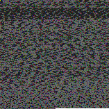

# PNGDrive

Pack your files into a PNG.

## Demo

http://pngdrive.devinhaus.com/

### Steganography

PNGDrive now supports Steganography: Files can be injected into a target bitmap.

Here is an example of PNGDrive Steganography in action, showing the Commodore 64 operating system ROMs injected into a Commodore logo with different numbers of bits per color component (2, 4, 6 and 8):

[Steganography Demo](http://pngdrive.devinhaus.com/examples/decode_steganography.html)

## Usage

### Preparation

	

### Encode

	
Drop files here

	

### Decode

	

	

### More examples

http://pngdrive.devinhaus.com/examples/decode.html

http://pngdrive.devinhaus.com/examples/decode_steganography.html

http://pngdrive.devinhaus.com/examples/encode_file_drag_drop.html

http://pngdrive.devinhaus.com/examples/encode_file_select.html

http://pngdrive.devinhaus.com/examples/encode_text.html

## API

Working on it..

## How?

PNGDrive.js stores data in the first three bytes (RGB) of a 32bit pixel value.
The forth byte (alpha value) is always set to 0xFF (255). It can't be used for data storage
due to limitations in the Canvas API. See the following note from the
[WhatWG Canvas Spec](http://www.whatwg.org/specs/web-apps/current-work/multipage/the-canvas-element.html#dom-context-2d-getimagedata)
for an explanation:

> Due to the lossy nature of converting to and from
> premultiplied alpha color values, pixels that have just been set using putImageData()
> might be returned to an equivalent getImageData() as different values.

### File Format

	Bytes 0..1           INTRO (Intro marker, 0xDADA)
	Bytes 2              VERSION_HI (File format version info, major)
	Bytes 3              VERSION_LO (File format version info, minor)
	Bytes 4..7           DIRLEN (Length of DIR in bytes, 32 bits, little endian)
	Bytes 8..8+DIRLEN-1  DIR (Directory in JSON format)
    Bytes 8+DIRLEN..     PAYLOAD

Example DIR structure:

	{
		files: [
			{ "name": "text.txt", "size": 12345, "type": "text/plain" },
			{ "name": "image.jpg", "size": 23456, "type": "image/jpeg" },
			{ "name": "binary.bin", "size": 34567 }
		]
	}

## Who?

Claus Wahlers (claus at madeinhaus dot com)

http://madeinhaus.com/

## Credits

PNGDrive.js uses TextEncoder/TextDecoder from the stringencoding project:

http://code.google.com/p/stringencoding/

Licensed under Apache License 2.0
